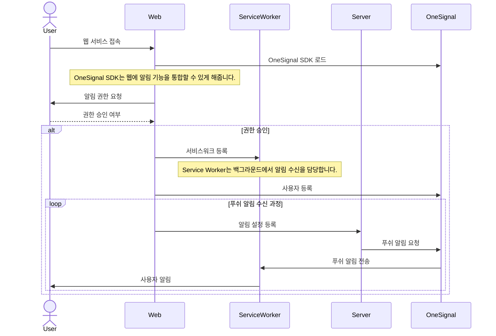

# 알림 마이크로 꾸러미 조각

> Single-Spa Parcel 구성

## 🛠️ 기술 스택

[![OneSignal](https://img.shields.io/badge/OneSignal-E54B4D.svg?logo=data:image/svg+xml;base64,PHN2ZyB4bWxucz0iaHR0cDovL3d3dy53My5vcmcvMjAwMC9zdmciIHdpZHRoPSI1NiIgaGVpZ2h0PSI1NiIgZmlsbD0ibm9uZSIgdmlld0JveD0iMCAwIDU2IDU2Ij4NCiAgPHBhdGggZmlsbD0iI2ZmZiIgZD0iTTI3Ljk0OCAwQzEyLjQ5OC4wMy0uMDg2IDEyLjc0NSAwIDI4LjIzM2EyOC4xMSAyOC4xMSAwIDAgMCA3LjI3NCAxOC43MTMgMjcuOTc4IDI3Ljk3OCAwIDAgMCAxNy44ODMgOS4wNTIuMzIxLjMyMSAwIDAgMCAuMzU1LS4zMjJWMjguMDcyaC0yLjE3NmEuMzIyLjMyMiAwIDAgMS0uMzIyLS4zMjN2LTQuMzU2YS4zMjMuMzIzIDAgMCAxIC4zMjItLjMyMmg2LjgzYS4zMjEuMzIxIDAgMCAxIC4zMjIuMzIydjMyLjI4M2EuMzIzLjMyMyAwIDAgMCAuMzU0LjMyMiAyNy45OCAyNy45OCAwIDAgMCAxOC40MTYtOS42NTcgMjguMTE2IDI4LjExNiAwIDAgMCA2LjcwNC0xOS43MjEgMjguMTAyIDI4LjEwMiAwIDAgMC04LjctMTguOTIyQTI3Ljk2NSAyNy45NjUgMCAwIDAgMjcuOTQ3IDBabTcuOTU4IDQ5Ljc0NWEuMzIuMzIgMCAwIDEtLjM5NC0uMTU2LjMyMy4zMjMgMCAwIDEtLjAzNS0uMTQ5di00LjYwN2EuNDg1LjQ4NSAwIDAgMSAuMjc2LS40MzggMTguMDU2IDE4LjA1NiAwIDAgMCA4LjUwNS04LjQ4NyAxOC4xMiAxOC4xMiAwIDAgMCAxLjMwOC0xMS45NTkgMTguMDg0IDE4LjA4NCAwIDAgMC02LjQ2Ny0xMC4xMzQgMTguMDA1IDE4LjAwNSAwIDAgMC0xMS4zNzgtMy44MjJjLTkuNTc5LjE0Ny0xNy40MzkgNy44OS0xNy43NDMgMTcuNDlhMTguMTM1IDE4LjEzNSAwIDAgMCAyLjYyNiA5Ljk5IDE4LjA3IDE4LjA3IDAgMCAwIDcuNjUgNi45MjIuNDgzLjQ4MyAwIDAgMSAuMjc3LjQzOHY0LjYwN2EuMzI1LjMyNSAwIDAgMS0uMjc4LjMyLjMyMS4zMjEgMCAwIDEtLjE1Mi0uMDE1IDIzLjA2MiAyMy4wNjIgMCAwIDEtMTEuMDE1LTguNTQzQTIzLjE1MiAyMy4xNTIgMCAwIDEgNC45OSAyNy44NTlDNS4xIDE1LjMyNyAxNS4zMTUgNS4wOTMgMjcuODIxIDVjMTIuNzc2LS4xMDMgMjMuMTk1IDEwLjI4NyAyMy4xOTUgMjMuMDcgMCA5Ljk0Mi02LjI5OSAxOC40MzUtMTUuMTEgMjEuNjc0WiI+PC9wYXRoPg0KPC9zdmc+&style=flat-square&logoColor)](https://onesignal.com/)
[](https://developer.mozilla.org/ko/docs/Web/API/Service_Worker_API)  
[](https://single-spa.js.org/)
[](https://ko.vite.dev)


## 💁 소개

웹 브라우저에서 사용자에게 알림 권한을 요청하고, 승인된 사용자에게 **OneSignal**을 활용하여 실시간 브라우저 푸시 알림을 제공하는 기능을 제공합니다.  
OneSignal SDK를 웹 애플리케이션에 통합하고, **Service Worker**에 등록함으로써 백그라운드에서도 안정적으로 알림을 수신하고 처리할 수 있도록 구성되어 있습니다. 이를 통해 페이지가 열려 있지 않아도 사용자에게 알림을 빠르게 전달할 수 있습니다.  
사용자 경험을 향상시키기 위해 권한 요청 흐름과 알림 수신/처리 로직은 사용자 친화적으로 설계되어 있으며, 브라우저 환경에서 안전하고 효율적인 푸시 알림 서비스를 제공합니다.

## 💡 주요 기능

-   Single-SPA 기반으로 모듈화되어 빌드됨
-   [MFA-Root](https://github.com/Daily1Hour/PickMe-MFA-Root)에 삽입되어 통합 운영됨
-   OneSignal 웹 SDK를 애플리케이션에 통합
-   푸시 알림 수신을 위한 Service Worker 등록
-   브라우저에서 사용자에게 알림 수신 권한 요청
-   사용자 식별 및 푸시 알림 설정 처리
-   브라우저가 닫혀 있어도 백그라운드에서 알림 수신 가능

## 🎨 스크린샷


## 📊 시퀀스 다이어그램



## 📂 폴더 구조

```
PickMe-Reminder-Parcel
├─ .github
│  └─ workflows # 깃헙 액션 워크플로어 프로세스
│     ├─ deploy-aws-s3.yml # AWS S3로 페이지로 배포
│     ├─ deploy-gh-pages.yml # 깃헙 페이지로 배포
│     └─ vite-build.yml # Vite로 빌드
├─ index.html # 진입점
├─ src
│  ├─ api
│  │  └─ getUser.js # 사용자 Parcel 사용
│  ├─ app
│  │  ├─ index.js
│  │  └─ parcel.js # Single-SPA 라이프사이클 구성
│  ├─ services
│  │  └─ configureOneSignal.js # OneSignal 설정
│  └─ serviceWorkers # 서비스워커
│     └─ OneSignalSDKWorker.js # 임포트파일
├─ vite.config.js # Vite 설정 파일
└─ vite.single-spa.config. # Single-SPA용 Vite 설정 파일
```

## 🚀 실행 방법

개발 서버 실행

```sh
$ npm install
$ npm run dev
```

Single-SPA 주입 애플리케이션 빌드

```sh
$ npm install
$ npm run build:single-spa
```
